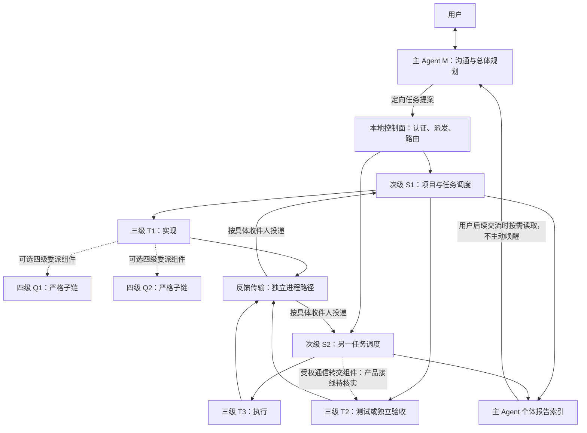
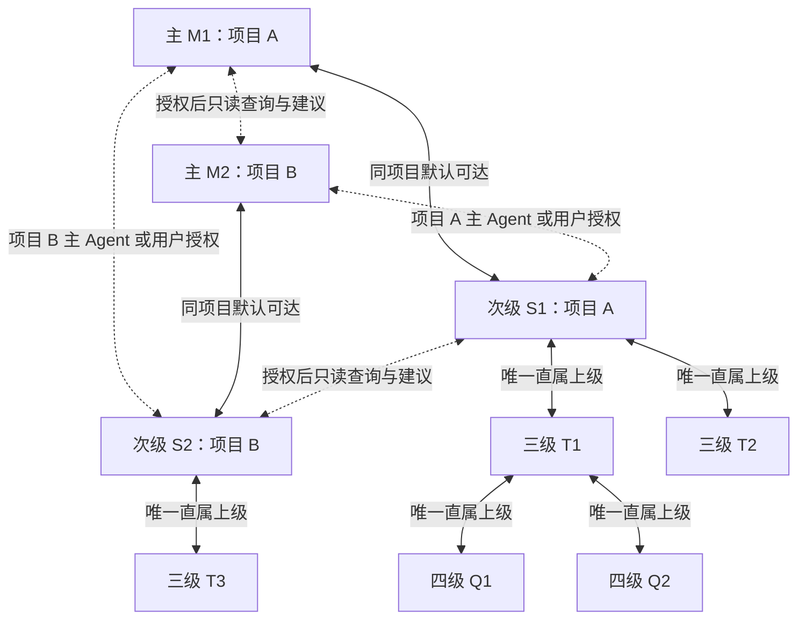

# Astarray

> 愿星光破开迷途。
> May starlight pierce the path astray.

面向长任务的多 Agent 编排工具，提供 CLI/TUI、本地 GUI 和 Node.js SDK。设计分工为主 Agent 交流与总体规划、次级调度和项目集成、三级执行任务，必要时受控委派四级。每个具体 Agent 独立存档，通过带来源的消息和附件协作。

**版本：0.1.0，仍处于产品接线、真实服务验证与验收收口阶段。** 本页于 **2026-10-01** 根据当前源码和仓库证据更新，不是对当前未提交工作树的全量测试声明。设计、实现、离线验证和真实服务验收不能互相替代。

## 当前进展

| 能力 | 当前可确认范围 | 限制 |
|---|---|---|
| CLI/TUI、npm 包 | 已有 mock 任务路径、状态和配置入口，Windows tarball 隔离验收记录 | mock 不代表真实模型任务能力 |
| Node SDK | 已接入共用应用运行时，公开 Provider 注册、任务及诊断入口；已有包级消费者证据 | 宿主负责适用的授权交互与真实用户认证 |
| 独立反馈 | SDK 的 provider 路径默认独立进程，已有默认路径测试 | 当前仍允许显式覆盖；mock 默认不同 |
| Provider | CLI 接受 openai-compatible；fake-server/工具循环已有证据，真实只读探针达到 done | “受控改动＋任务 done”真实闭环仍待收口，不代表所有厂商支持 |
| 上下文与恢复 | 已有预算、关闭/回访组件及 context、recover 产品入口 | 实际续接和恢复预览不同，组合故障场景仍需验证 |
| 摘要与运行引导 | 已有 summary、guide 入口及接线报告 | 不等于智能指令窗口和完整历史回溯已实现 |
| 多格式代码读取 | C 系、Python、Rust、前端、LaTeX 等策略已有隔离包证据 | 不等于办公文档布局语义提取已完成 |
| 本地 GUI / 外部桥接 | 已有 gui、mcp serve；GUI 服务器、SSE、设置/恢复及 Windows 包验证记录 | 人工体验、其他平台和真实服务分别验收；不代表全部外部协议支持 |

主要证据：

- [SDK 默认反馈进程与 Provider 公开入口](docs/reports/SDK_DEFAULT_FEEDBACK_PROCESS_AND_PROVIDER_EXPORTS_2026-09-28.md)
- [SDK 授权端口与身份绑定](docs/reports/SDK_AUTHORIZATION_PORTS_AND_IDENTITY_2026-09-28.md)
- [真实 Provider 阶段证据及限制](docs/reports/T07D_R2_04_LIVE_PROVIDER_EVIDENCE_2026-10-01.md)
- [多格式读取包级验证](docs/reports/READ_FORMAT_05B_PACKAGE_AND_METRICS.md)
- [运行引导产品入口](docs/reports/GUIDE01_04_PRODUCT_ENTRY.md)
- [GUI Windows 打包证据](docs/reports/GUI01_R_04B_WINDOWS_PACKAGING_EVIDENCE_2026-09-19.md)

状态表和旧卡仍有历史 pending/done 与后续报告未同步的记录。冲突时核对具体提交、检查点及动态证据，不按标题判断整项完成。实施顺序见 [产品 rollout](docs/tasks/PRODUCT_INTEGRATION_ROLLOUT.md)。

## Agent 编排与通信连接图

2026-10-05 静态核查：已有分层调度、定向反馈、个体来源与四级绑定组件；**尚不能宣称主—次级全连接及全入口唯一上级已完整落地**。下图展示当前代码对应的结构与可选组件，不是所有连接均已通过产品验收。字母仅为示例，实际对象必须按不可复用的 `agentInstanceId` 寻址。

实线表示已有主要控制/报告路径，虚线表示可选组件，不能据此推断已在所有产品入口接通。反馈框是传输设施，不是额外 Agent；其扇入扇出不代表全员广播或共享记忆。SDK provider 默认独立反馈进程，显式覆盖与 mock 路径的差异仍见上方当前进展。

### 新增目标：上层受控全连接，下层唯一上级（待实施）

目标图的所有边均由本地控制面和独立反馈进程路由，不是模型间直连。**同项目的主层与次级层默认全连接，不逐边申请通信授权；跨项目按需连接，须目标项目有权主 Agent 或用户授权。** 单会话仍只有一个主 Agent；同项目多个会话的主 Agent 均可定向联系本项目次级，但不共享会话历史。跨项目授权仅覆盖明确对象/范围及关联回复，可到期、撤销，不自动开放两个项目全网。全连接不表示默认广播、同层全互通、任务控制权转移或跨项目文件权限。

三级、四级执行者只向唯一直属上级请示和报告；其他 Agent 的协作请求经直属上级代理转达，保留原始来源，不额外形成指挥关系。模型不负责猜测接收者，路由由本地身份、项目/会话、任务和关系 revision 校验。任务卡：[COMM-01 上层寻址与唯一上级](docs/tasks/COMM01_ADDRESSABLE_UPPER_LAYER_AND_SINGLE_PARENT_TASK_CARD.md)（pending，含旧转交规则迁移、测试与实施顺序）。

**所有跨项目连接仅限授权范围内的只读查询、资料交流与建议，放权模式也不例外。** 主—主、次级—次级可以申请同层建议通道；三级/四级经唯一上级代理沟通。外来 Agent 不能直接修改目标项目，也不能借建议自动触发命令、文件、配置、任务队列或 Git 变更。目标项目有权 Agent 独立采纳建议后，才按本项目权限创建任务并执行；通信许可不代替资源读取或执行授权。

## 优化目标

2026-10-10 新增设计（**待实施，不代表当前版本已具备**）：[智能合并与无损上下文管理任务组](docs/tasks/MERGE01_NODECTX01_TASK_CARDS.md)。相容指令合并执行但保留逐项来源、授权及验收；工具通过参数适配，设置保留单工具统一授权，增加参数授权总开关、每工具细分开关和规则列表。

本项目禁用有损上下文压缩的目标方案是：原始历史完整留存，总结仅作为独立辅助资料；上下文不足时，将暂不需要的非紧急/非重要节点原样存盘并临时关闭，先处理前置节点，窗口释放后自动补回。已验收节点可永久退出自动装配，但仍可显式回访原文。不会以静默截断或摘要覆盖历史解决超限；实现与兼容迁移见 NODECTX-01。

本项目围绕以下核心目标持续演进（详见 [`designtodo.txt`](./designtodo.txt) 与实施计划）：

1. **增加缓存有效率，而非单纯提高命中率**——缓存的意义在于切实降低下游开销：重复读取抑制、读取回执与有界检测共同保证缓存命中不浪费、不误导。
2. **减少总调用次数与总 token 消耗量**——控制面直投小任务、次级汇报压缩为带来源摘要、跨 Agent 附件不自动并入长期记忆、工具说明按 revision 回访，全部以省去重复调用与冗余上下文为目标。
3. **提高并发调用数量**——并发与调度仅受队列、回收和资源约束，不对历史 Agent 实例数量设产品配额；多 Worker、独立反馈进程与信箱机制支撑横向扩展。
4. **多 Agent 沟通架构**——主 Agent 与子 Agent 脱离：任何时刻都可与主 Agent 通信但不打断任务进行。反馈进程独立运行，报告只入存档、不自动唤醒主 Agent。
5. **安全与确定性基线**（支撑以上目标的约束）：思索模式本地只读、敏感操作本地判定、全模式敏感文件禁读、安装双重门禁、可配置权限模式、明确完成控制事件与早停恢复、事实验证与反自指/活锁防护。
6. **只需一次方案部署，后续相同场景终身自动化**——将已验证方案沉淀为可复用工作流，在适用条件和有效授权范围内持续自动执行；场景、权限或关键依赖变化时重新校验，避免重复规划与部署。

上下文优化不只观察普通缓存命中率，还会衡量可复用 token 比率、已关闭上下文的 token 节省率、关闭节点回访率、同一 revision 重复回访率、过早关闭率，以及延迟人工验收被否决后的下游影响范围。

## 安装与快速开始

package.json 声明 **Node.js ≥20**。主要已有动态证据来自 Windows / Node 24；引擎声明不等于所有版本和平台已验收。本轮未核验 npm 注册表发布状态，推荐从源码或本次已验证 tarball 使用，不将注册表同名包当作本地最新版。

### 从源码运行

已有依赖可用时无需重复安装；npm ci 会安装依赖，应先确认资源和安装授权。

~~~powershell
npm ci
npm run check
node dist/cli.js --help
node dist/cli.js run "验证本地任务流程" --mode assist --runtime mock --json
node dist/cli.js status --json
~~~

TTY 下运行 node dist/cli.js 进入 TUI；本地浏览器工作台：

~~~powershell
node dist/cli.js gui --runtime mock
# 仅启动服务，不自动打开浏览器
node dist/cli.js gui --runtime mock --no-open
~~~

GUI 是本地 loopback 服务，不应直接暴露为公网多用户服务。

### 打包与隔离验收

~~~powershell
npm pack
node scripts/verify-package.mjs ./astarray-0.1.0.tgz
node scripts/smoke-install.mjs
~~~

使用 npm pack 本次实际输出文件名，版本变化时同步调整。prepack 会运行 npm run check；隔离安装脚本可能调用 npm，应先检查缓存及安装/网络条件，不隐式下载。

需要全局安装时，在取得安装授权后使用已验收的本地包：

~~~powershell
npm install -g ./astarray-0.1.0.tgz
astarray --help
~~~

## Provider 接入

CLI 协议运行时名称为 openai-compatible；SDK 使用 runtime: "provider" 并注入公开的 ProviderRuntimeRegistry。这是协议接入，不表示仅支持某一家服务，也不代表所有兼容服务都已验收。

真实调用先配置受保护凭据引用，并确认网络、模型和费用授权：

~~~powershell
node dist/cli.js config provider credential-set --help
node dist/cli.js config provider register --help
node dist/cli.js run --help
~~~

使用已配置引用的命令模板，须替换占位值：

~~~powershell
node dist/cli.js run "一个明确的小任务" --mode assist --runtime openai-compatible --provider-model "<model-id>" --provider-credential-reference "<reference-id>" --timeout-seconds 120
~~~

- 端点按当前实现使用完整请求 URL；需要显式提供时使用 --provider-endpoint，不假定自动补全请求路径。
- 环境变量入口为 --provider-api-key-env <变量名>；不要把密钥写进提示词、命令字面量、日志或提交。优先使用受保护凭据引用。
- Provider 目录登记与实际运行解析仍有接线限制，不能认为只登记名称即可自动选中模型/端点。
- 真实只读探针已有成功；受控写入闭环、多入口真实一致性和多模态仍有未验证范围，详见阶段报告。
- 协同交互首次验收建议使用 TTY，每次授权核对具体参数；管道 EOF、多次裁决和重试仍需对应证据，不能复用旧输入冒充新授权。
- 工具成功、模型声称完成和本地任务 done 是不同证据，必须核对同一次运行的产物和终态。

本地 fake-server 不消耗真实模型额度；verify:t07d-r2-04-live 等真实脚本不应作为普通离线检查执行。

## SDK 与模式设置

安装包通过 import … from "astarray" 提供 AstarrayApplicationFacade、Provider 注册接口及公开类型。消费者不应导入仓库内部文件。公开入口用法可参考 [SDK 包级消费脚本](scripts/verify-sdk-default-path.mjs)。

- getRuntimeDiagnostics() 显示实际运行时、反馈进程和授权端口；getMetricsSnapshot() 提供基础指标，不是完整监控平台。
- backupDeletionControlPort、installationUserPort 可由宿主注入；需要交互但缺少端口或身份时不得自动批准。
- 身份可来自宿主上下文或显式传入。一个字符串本身不是远程认证，多用户服务须由宿主完成认证。
- 主 Agent 身份的跨会话隔离和恢复应结合部署方式验证，状态目录派生身份不等于通用多用户身份方案。
- 使用结束必须关闭应用并回收子进程；导入包本身不应启动后台任务。

权限配置采用 deny / ask / allow，支持命名自定义权限组；具体入口见 profile --help、session --help。

| 模式 | 中文名 | 公开使用方式 |
|---|---|---|
| ponder | 思索模式 | 只读分析模式，不提供可调整权限矩阵 |
| assist | 协同模式 | 按实际作用范围和设置由有权上级或用户裁决；项目外、外部软件和范围未知操作需人工确认 |
| devolve | 放权模式 | 可配置权限默认允许，可逐项改为询问或禁止；不自动启用实验功能 |

安装前先确认是否已有资源；项目内且作用范围可验证的安装可由有权上级按设置批准，项目外/全局环境变更等仍需用户逐次授权。独立安装开关、精确参数绑定和执行前检查继续生效，不能只凭命令工作目录判断范围。

## 状态、恢复与其他入口

以下命令使用安装后的 astarray；源码环境可替换为 node dist/cli.js。

~~~powershell
astarray status --json
astarray doctor --json
astarray recover list --json
astarray recover show <mission-id> --json
astarray context --help
astarray summary --help
astarray guide --help
astarray profile --help
astarray session --help
astarray mcp serve --help
~~~

recover resume <mission-id> 与附加 --execute 的效果不同：后者在对账允许时实际续接任务，应先查看帮助及恢复结果。普通 resume、取消和诊断也应按具体命令确认副作用，不把所有 doctor 检查视为纯读取。

JSON 用于机器消费；不能以输出中某个成功词代替退出码和任务状态。状态默认存放于工作目录的 .astarray/，包含任务、个体存档、配置和恢复数据。**不要把删除整个状态目录当作日常清理**；先确认需要保留的历史、备份和任务，再走适用的归档/清理流程。

## 后续设计与任务

以下为实施计划，不是已交付功能承诺；基础模块存在不代表整卡通过。

| 方向 | 任务入口 |
|---|---|
| 作用域权限、准确性开关、格式读取、本地 Git 保全 | [增量任务卡](docs/tasks/2026-09-16_INCREMENTAL_DESIGN_TASK_CARDS.md)，部分已有后续实现证据 |
| 模型配置对齐的沟通经验 | [LESSON-01](docs/tasks/LESSON01_MODEL_ALIGNED_COMMUNICATION_MEMORY_TASK_CARD.md) |
| 内容优先读取、对话设置、工作时段、可靠性审计 | [2026-10-01任务组](docs/tasks/2026-10-01_RUNTIME_USABILITY_AND_RELIABILITY_TASK_CARDS.md) |
| 性能、用量、错误汇总与诊断 | [OBS-01](docs/tasks/OBS01_PERFORMANCE_USAGE_AND_DIAGNOSTICS_TASK_CARDS.md) |
| 三条默认活动指令窗口、早停/澄清区分及主 Agent 响应期限 | [SMART-01](docs/tasks/SMART01_INSTRUCTION_WINDOW_AND_MAIN_RESPONSIVENESS_TASK_CARD.md) |
| resume 后的历史时间线与工具链回溯 | [HISTORY-01](docs/tasks/HISTORY01_LOCAL_RUN_HISTORY_AND_RESUME_VIEW_TASK_CARD.md) |
| 工作流折叠、有界探索、授权式定期历史梳理 | [EXP-01](docs/tasks/EXP01_WORKFLOW_DISCOVERY_AND_HISTORY_MAINTENANCE_TASK_CARDS.md) |
| 内嵌文本/代码微调原型 | [WB-00](docs/tasks/WB00_MICRO_EDIT_WORKBENCH_PROTOTYPE_TASK_CARD.md) |

**所有实验功能默认关闭，仅用户可显式启用。**启用一项不连带开启其他项；定期梳理的首次方案和重大调整均需授权。高级媒体编辑仍是未来方向。

## 验证范围与当前限制

- Windows 有多轮 check、覆盖率和 SDK/GUI tarball 证据，见 [E2E质量声明](docs/reports/E2E01_04_QUALITY_STATEMENT.md)及其刷新报告。旧数字不能代表当前未提交工作树；本次文档更新未重跑测试。
- Linux 路径/超时已有返修记录，不等于完整平台通过。Linux/macOS、Node 20 和 GUI 人工体验仍需对应最新证据，未验证项不能填绿。
- 真实受控改动检查点仍待完整收口。一次性授权预留/结算、参数一致性及重试边界是近期返修重点；不同尝试分别成功不能拼成一次端到端通过。
- 基础 usage 捕获存在，但真实计费用量不是处处可得；缺失不是零，估算不是账单。
- SDK 身份字符串、主 Agent 实例归属及服务端认证仍须部署方核查，不把本机测试等同多用户生产验证。
- 规划、执行、权限、恢复的组合可靠性仍需受控项目验证，不能据模块存在宣称任意工业项目无人值守完成。
- 部分状态文档尚未同步后续报告；追溯证据，不任选有利结论。

## 开发与文档导航

~~~powershell
npm run typecheck
npm run lint
npm run test
npm run test:coverage
npm run build
npm run check
npm run verify:security-coverage
~~~

test 的 pretest 会构建；打包以本次 tarball 隔离安装为准。先确认已有依赖，不在检查中隐式安装新工具或触发真实服务。

- [工程规范](AGENTS.md)：命名、协作与交付要求。
- [架构大纲](agent-main-architecture.md)、[实施计划](IMPLEMENTATION_PLAN.md)、[状态记录](PLAN_STATUS.md)。
- [任务索引](docs/tasks/README.md)、[产品 rollout](docs/tasks/PRODUCT_INTEGRATION_ROLLOUT.md)。
- [目录职责与整理记录](ORGANIZATION.md)。

每次领取一个检查点，先反例后实现与验证，记录剩余限制。保护人工和其他 Agent 的并行修改，不用历史完成记录替代当前版本验收。
